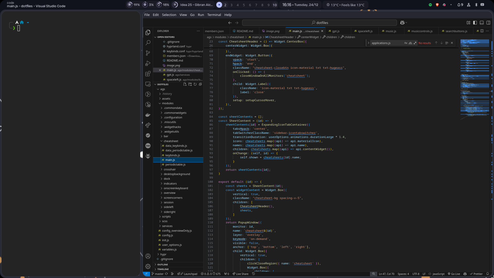

# Pegoku Dotfiles
Laptop branch (v2)

## System updates and T3 Code

Run `up` in Zsh to update with Yay and then synchronize the separately installed
T3 background service with the installed `t3code-bin` desktop package version.
Package operations show a consent dialog and use Polkit authentication.
The T3 update runs as your user and may restart the service, interrupting active
agent work. It runs only after a successful package update.

Other modes (run from this repository):

```sh
scripts/t3-system-update pacman   # official packages, then T3 synchronization
scripts/t3-system-update sync     # synchronize T3 after a separate yay/pacman update
```

Pacman does not update AUR packages; use Yay to update `t3code-bin`.
Ordinary `yay`/`pacman` commands do not trigger synchronization automatically.
The script pins T3 to the installed desktop version instead of downloading a
possibly newer backend. Unsupported package versions and download failures are
reported as errors. Downgrades require an explicit manual T3 update.

## Screenshots



## Credits

https://github.com/end-4/dots-hyprland
